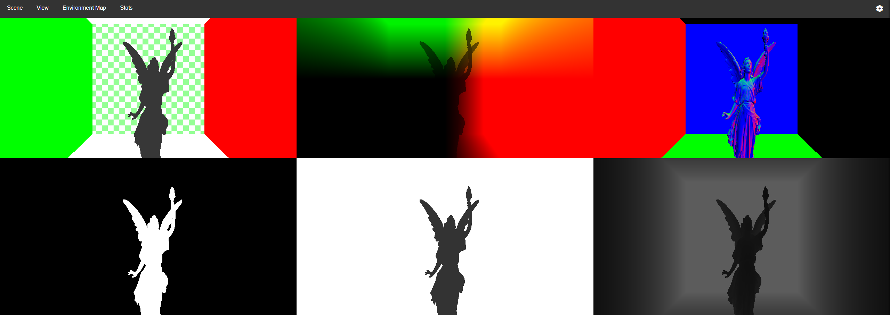

# Advanced Screen Space Techniques for Real-Time Rendering

This repository contains the code accompanying my PhD thesis, which presents novel extensions to Screen Space Ray Tracing (SSRT) for real-time rendering, focusing on reflections and refractions. Traditional screen space techniques, such as Screen Space Reflections (SSR), face limitations when handling objects outside the camera’s view or those occluded by other geometry. To address these challenges, a Two-Camera SSR method is proposed, using a secondary camera to capture reflections from off-screen objec...

This repository implements a complete real-time renderer designed to showcase these novel techniques. The renderer was developed entirely from scratch using WebGPU, a modern JavaScript graphics API offering low-level GPU access comparable to Vulkan and Direct3D, all within a web-based environment, without external dependencies.

## Functionalities
The renderer implements only the necessary functionalities to showcase the proposed techniques, including:

- glTF loading with Metallic-Roughness, Transmission, and Volume extensions
- Environment Mapping
- Point Lights (Directional, Punctual, and Spot Lights)

Features not implemented include:

- Animations
- Normal Maps
- Shadow Maps

## Data Format
The renderer supports scenes in the glTF format. Default scenes, used to showcase various functionalities, are included and can be selected directly through the user interface. To add a custom scene, store the glTF file and its binary files in the folder: `public/glTF/CustomSceneName/`. Ensure that the glTF file and binary file have matching names, e.g., `public/glTF/MyCustomScene/MyCustomScene.gltf` and `public/glTF/MyCustomScene/MyCustomScene.bin`. Finally, add the path of the glTF file to `src/data/mo...

## How To Run
The renderer requires only Node Package Manager (npm). To start, run:

```
npm start
```

Then open a web browser and go to: `http://127.0.0.1:8080`. The renderer was tested on Google Chrome version 130.0.6723.60 but should work in other browsers or Chrome versions. Note that WebGPU allows http connections only from localhost. For running on a local network, switch to https by generating a server private key and self-signed certificate with the following commands:

```
openssl genpkey -algorithm RSA -out server.key
openssl req -x509 -key server.key -in server.csr -out server.cert -days 365
```

Place `server.cert` and `server.key` in the root folder, then change line 6 in `package.json` from:

```
"start": "npm install && npm run build && npm run serve-local",
```

to:

```
"start": "npm install && npm run build && npm run serve-lan",
```

The server will be available in the local network at the specified address, such as `https://192.168.1.56:8080`.

## User Interface
The renderer is implemented as a single web page, loading a default scene (a glossy metallic statue) on startup:


Navigate the scene with `WASD` keys for movement and the mouse (left-click on the canvas to acquire mouse control; press `Esc` to release). Select other scenes from the top menu:


Additional settings are accessible via the gear icon at the top right. For Screen Space Reflections, options include:

- Enabling/disabling Two-Camera Screen Space Reflections (enabled by default).
- Double Rear FOV: doubles the rear camera's field of view to reduce distortion in reflections.
- Cone Tracing: enables blurring of reflections based on distance traveled and surface roughness. Particularly evident in the Contact Reflections scene:


For refractions, users can toggle between two methods for computing the second interface. The volume object is approximated with two interfaces: the ray enters through the first, travels within, and exits through the second:


Below are the two methods, Front/Back Buffer on the left and Depth Peeling on the right:


The effect on the `Dragon Volume` scene is shown here:


When Enable Env Proxy is active, the environment map approximates reflections/refractions if screen space visibility is lacking. This affects both reflections and refractions.

### Debug Views
The renderer provides several debug views, accessible from the View menu, categorized by geometry type:

- Opaque: blocks light.
- Transparent: thin-transparency, where light passes through without refraction.
- Volume: volumetric transparency, with light bending according to material IOR.

The available debug views vary by geometry type and are described below.

#### Scene Lit
Displays the fully lit scene, including point lights, reflections, refractions, and environment effects (if enabled). 

#### GBuffer
Shows the different textures in the Geometry Buffer (GBuffer) for: base color, view space positions, view space normals, metalness, roughness, and depth:



#### Reflections
Three views: Reflections, Reflections Visibility, and Reflections UV. The first shows the reflection buffer, the second indicates screen space reflection visibility (white for visible pixels, black otherwise), and the third shows the UV coordinates of the reflected color (white if not visible).


#### Transparent
For transparent geometry, the same views as for opaque geometry are available, as these objects also reflect light. Since there is no refraction, colors behind transparent objects are obtained by rendering the scene without transparent geometry.

#### Volume
For volumes, the Environment Map shows volume objects refracting only the environment map (ignoring roughness):


GBufferLayer1 and GBufferLayer2 show the first and second interfaces of the volume object (normals shown below):


The Refraction view shows the refraction buffer:


Refraction Distance Traveled, Refraction Visibility, and Refraction UVs show the distance the ray travels within the object, refraction visibility, and the UVs of the refracted color, respectively:


## Code Structure

The `src/main.ts` file initializes the camera, renderer, and user interface controls.

The renderer, implemented in `src/renderers/Renderer.ts`, follows a modular structure based on Deferred Shading. Each functionality—such as Point Light Shading, Screen Space Reflections, Screen Space Refractions, and Transmission—is implemented in separate render passes within the `src/passes` directory, each encapsulated in its own class. The programmable stages of these passes are defined in shaders located in `src/shaders`. The main renderer, used to render all examples on the web page, handles data transfer between the various render passes.
